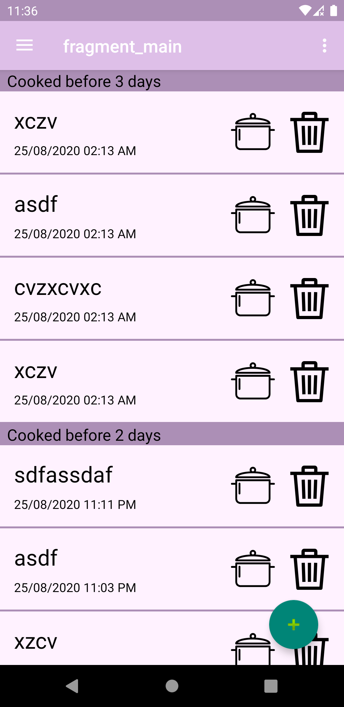
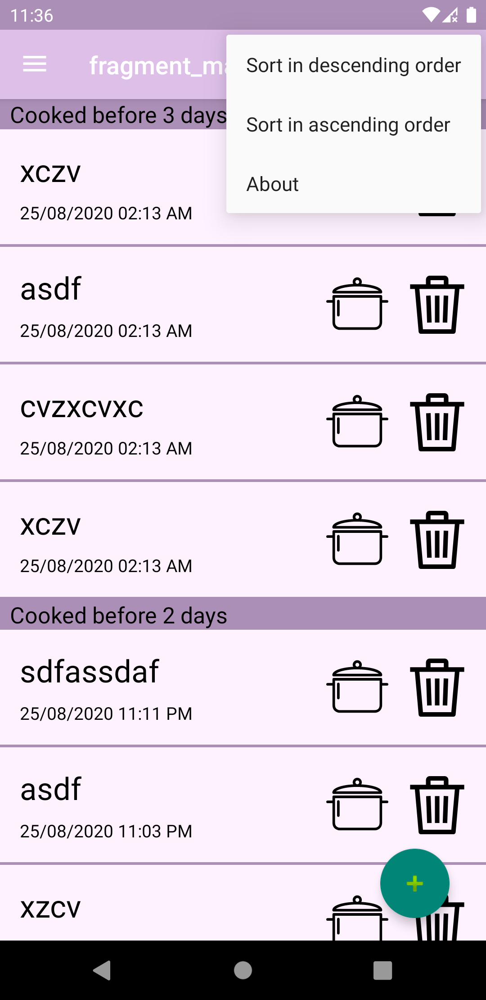

<h1> CookReminder </h1> 

Project descriptionCook Reminder is a simple Android application that list all cook and remind you with the ones you didn't cook for a while. I wrote the app with Kotlin and designed the GUI with android studio. The project has two branches. The first one is using the Room database as a local database and does not need registration for use. The second one is using the Firebase Real-time Database to store data online and it needs registration for use and users can access their data from any other device.

<h2> Screenshots </h2>

